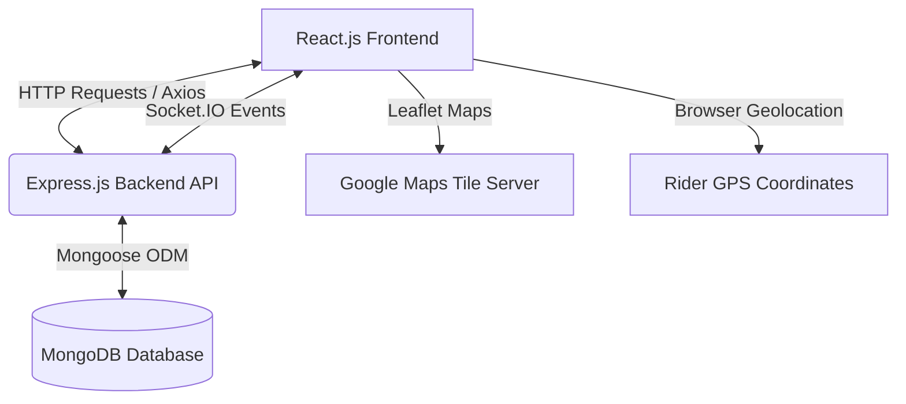

# Hyper-Local Delivery Dispatcher

**Hyper-Local Delivery Dispatcher** is a production-ready, full-stack MERN (MongoDB, Express, React, Node.js) application designed as an internal delivery management system for local stores (e.g., grocery shops, pharmacies) to coordinate and monitor their own delivery staff.

It features secure role-based JWT authentication, a store dashboard for managing and dispatching orders, a rider dashboard with live geolocation tracking, and a real-time tracking map powered by Leaflet (with Google Maps tile overlays) and WebSockets (Socket.IO).

---

## 🛠️ Tech Stack & Architecture



### Frontend
- **React.js (Vite)**: Fast, modern UI development
- **Zustand**: Lightweight global store for authentication state management
- **React Router (v7)**: Client-side routing and protected routes
- **Tailwind CSS (v4)**: Modern, utility-first CSS styling
- **Leaflet & React-Leaflet**: Dynamic map markers, custom icons, and automatic bounds fitting
- **Socket.IO Client**: Establishes real-time connection for tracking broadcasts

### Backend
- **Node.js & Express**: Scalable API server
- **MongoDB & Mongoose**: NoSQL database for users, orders, location history, and rider earnings
- **JSON Web Token (JWT) & Bcryptjs**: Secure authentication and hashed passwords stored in HTTP-Only cookies (or Authorization Bearer headers)
- **Socket.IO Server**: Manages WebSocket connections to broadcast live GPS coordinates from riders to dispatching store managers

---

## 🚀 Key Features

1. **Role-Based Auth (RBAC)**:
   - **Store Admin**: Can create, edit, delete orders, view active riders, manually assign orders, and monitor coordinates live.
   - **Delivery Rider**: Can accept/reject incoming dispatch requests, update delivery statuses, toggle live GPS sharing, and view their earnings log.
2. **Real-time Tracking**:
   - Automated GPS capturing using the browser's Geolocation API.
   - Updates are pushed to the backend and broadcasted to listening store admins instantly over WebSockets.
3. **Automated Earnings Tracking**:
   - Payout of ₹50 per trip is calculated and credited to the rider's ledger upon marking an order as `delivered`.
   - Dedicated earnings ledger showing total earnings, completed count, today's split, and detailed history logs.

---

## 📦 Project Structure

```
Hyper-Local-Delivery/
├── Backend/                    # Node.js Express server
│   ├── APIs/                   # Route files (auth, orders, location, earnings)
│   ├── Models/                 # Mongoose schemas (User, Order, Location, Earnings)
│   ├── Middleware/             # JWT auth & route protection
│   ├── Services/               # Password hashing & authentication helpers
│   ├── server.js               # Entry point (integrates Socket.IO)
│   └── package.json
└── Frontend/
    └── hyper-local-delivery/   # React Vite App
        ├── src/
        │   ├── components/     # UI Pages (AdminDashboard, RiderDashboard, MyOrders, etc.)
        │   ├── store/          # Zustand authstore & orderstore
        │   ├── api.js          # Axios configuration and global interceptor
        │   └── App.jsx         # Routes definition
        └── package.json
```

---

## ⚙️ Quick Start

### 1. Prerequisite Setup
Ensure you have Node.js (v18+) and MongoDB running locally on your machine.

### 2. Backend Server Setup
Navigate to the `Backend` directory, configure the environment, and launch:
```bash
cd Backend
npm install
```
Create a `.env` file inside the `Backend` folder:
```env
PORT=4000
DB_URL=mongodb://localhost:27017/hyperdelivery
SECRET_KEY=your_secure_jwt_secret_key_here
```
Run the development server:
```bash
node server.js
```

### 3. Frontend Client Setup
Navigate to the `Frontend/hyper-local-delivery` directory and run:
```bash
cd Frontend/hyper-local-delivery
npm install
npm run dev
```
Open [http://localhost:5173](http://localhost:5173) in your browser to view the application.

---

## 🔒 Security Practices
- Hashed user passwords using `bcryptjs` before committing to MongoDB.
- Route protection checking JWT payloads.
- Custom middleware supporting token resolution from HTTP-Only cookies or `Authorization Bearer` headers.
